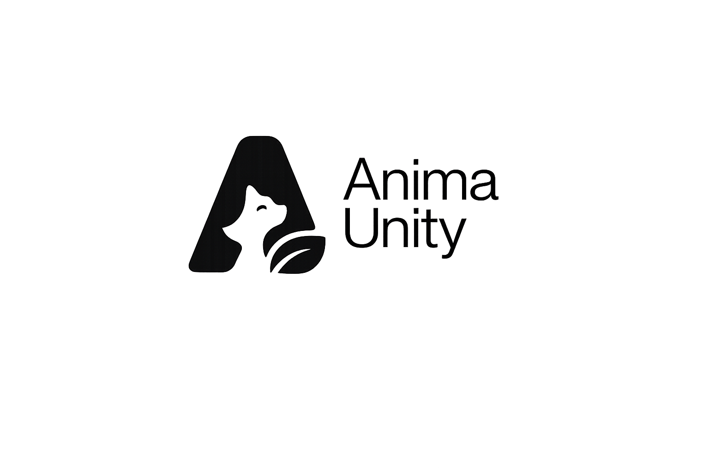

<div align="center">
  
  <br/><br/>

  [](https://github.com/AnimaUnity)
  [](https://github.com/AnimaUnity)
  [](https://opensource.org/licenses/MIT)
  [](https://github.com/AnimaUnity)
  [](https://status.animaunity.com)

  [Portal](https://animaunity.com) · [Docs](https://docs.animaunity.com) · [API Reference](https://api.animaunity.com/docs) · [Status](https://status.animaunity.com) · [Discussions](https://github.com/orgs/AnimaUnity/discussions)
</div>

---

**Anima Unity** adalah platform SaaS enterprise yang mengorkestrasikan siklus hidup perawatan hewan — dari intake shelter, triase medis, adopsi, hingga telemetri GPS pasca-adopsi. Satu ekosistem terdistribusi yang menghubungkan shelter, klinik veteriner, relawan, dan adopter.

> *"Membangun infrastruktur untuk mereka yang tidak bisa bersuara."*

---

## Module Registry

| Repository | Status | Deskripsi | Stack |
|:---|:---:|:---|:---|
| [`platform`](https://github.com/AnimaUnity/platform) |  | Super-App mobile (iOS/Android). Modul Mission Logs, adopsi, notifikasi real-time. | Expo · React Native · TypeScript |
| [`shelteros`](https://github.com/AnimaUnity/shelteros) |  | Dashboard enterprise untuk manajemen shelter: kapasitas, tracking adopsi, multi-tenant. | React · TypeScript |
| [`api-service`](https://github.com/AnimaUnity/api-service) |  | Backend monolitik modular: persistence, JWT auth, business logic utama. | Spring Boot · PostgreSQL · Hibernate |
| [`anitrack-iot`](https://github.com/AnimaUnity/anitrack-iot) |  | Firmware GPS tracker hewan + pipeline telemetri MQTT → REST. | C/C++ · MQTT |

---

## Tech Stack

**Frontend** ·   

**Backend** ·   

**DevOps** ·   

---

## Getting Started

**Prerequisites:** Java 21+, Node.js 20+, Docker 24+

```bash
# Clone
git clone https://github.com/AnimaUnity/api-service.git
git clone https://github.com/AnimaUnity/platform.git

# Setup env
cp api-service/.env.example api-service/.env

# Spin up infrastructure
docker-compose -f infra/docker-compose.yml up -d

# Backend
cd api-service && ./gradlew bootRun

# Mobile client
cd platform && npm install && npx expo start
```

> Pengembangan via Termux didukung penuh. Lihat [`docs/termux-setup.md`](docs/termux-setup.md).

---

## Engineering Standards

**Commit convention** — [Conventional Commits](https://www.conventionalcommits.org)

```
feat(api): add rescue report endpoint
fix(platform): resolve adopter auth loop
docs: update shelter onboarding guide
```

**PR checklist** — wajib sebelum request review:

- [ ] Unit test (JUnit/Jest) lolos di lokal
- [ ] Build bersih di Docker
- [ ] Tidak ada hardcoded secrets atau API keys
- [ ] Test coverage ≥ 80% untuk kode baru
- [ ] Breaking changes tercatat di PR description

**Branch strategy:** `main` (production) ← `develop` (integration) ← `feat/*` / `fix/*`

---

## Security

Sistem menangani data sensitif: lokasi GPS real-time, data operasional shelter, informasi adopter.

| Kebijakan | Detail |
|:---|:---|
| Secrets | Gunakan `.env` atau secret manager. Hardcode = **block PR**. |
| Auth | JWT RS256 · access token 1h · refresh token 7d |
| Enkripsi | At-rest: AES-256 · In-transit: TLS 1.3 minimum |
| Dependency | `npm audit` + `./gradlew dependencyCheckAnalyze` wajib sebelum release |
| Vulnerability | Report ke `security@animaunity.com` (privat). **Jangan buka public issue.** SLA: 48 jam. |

Standar mengacu pada **OWASP Top 10** dan **OWASP Mobile Top 10**.

---

## Roadmap

| Milestone | Target | Status |
|:---|:---:|:---:|
| Core API + Auth | Q1 2026 | ✅ |
| Mobile App (iOS/Android) | Q2 2026 | 🔄 |
| ShelterOS Beta | Q2 2026 | 🔄 |
| AniTrack GPS Integration | Q3 2026 | 📋 |
| Multi-tenant Shelter Network | Q3 2026 | 📋 |
| Southeast Asia Expansion | Q4 2026 | 📋 |

---

## Contributing

Baca [`CONTRIBUTING.md`](CONTRIBUTING.md), buka issue, atau langsung PR.

```bash
git checkout -b feat/nama-fitur
git commit -m "feat(scope): deskripsi singkat"
git push origin feat/nama-fitur
```

---

<div align="center">
  <sub>Copyright © 2026 Anima Unity · MIT License · <a href="mailto:security@animaunity.com">security@animaunity.com</a></sub>
</div>
